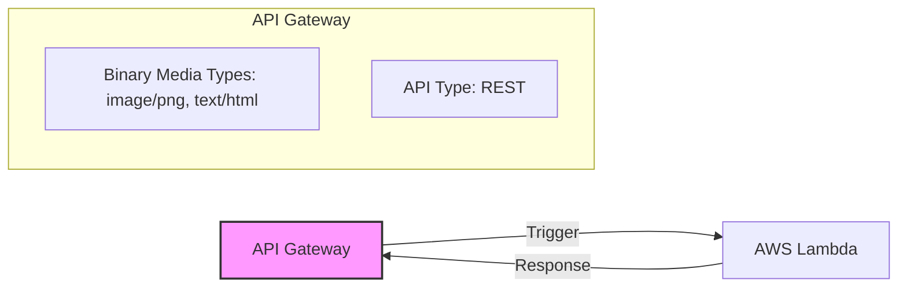

```mermaid
graph LR
  A[API Gateway]
  A -- Trigger --> B[AWS Lambda]
  B -- Response --> A
  style A fill:#f9f,stroke:#333,stroke-width:2px

  classDef class1 fill:#f9f,stroke:#333,stroke-width:2px;
  class A class1;

  subgraph "API Gateway"
    D[Binary Media Types: image/png, text/html]
    E[API Type: REST]
  end
```

```zsh
$ make role
$ make deploy
```

```
https://api-gateway-id.execute-api.region.amazonaws.com/default/function-name?shape=<shape>&size=<size>&color=<color>
```
